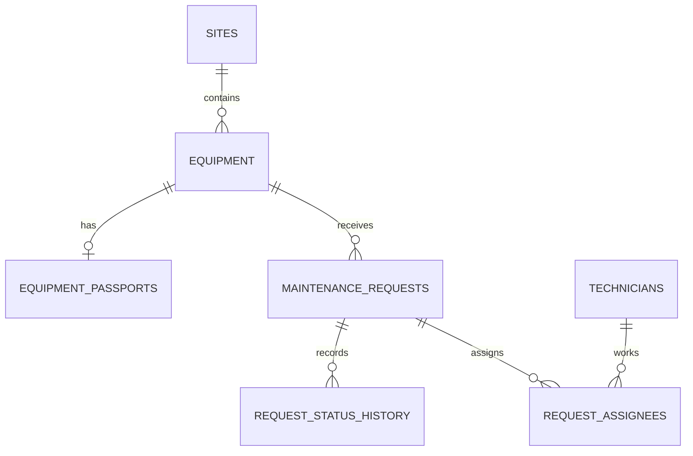

# Weather Digest / Maintenance API

REST API для учёта оборудования и заявок на обслуживание производственной площадки.
Хранилище выбирается через `USE_POSTGRES`: `false` использует JSON-файлы, `true` — PostgreSQL.
Внешний прогноз использует Open-Meteo.

## Быстрый запуск API

```bash
npm install
npm start
```

Сервер по умолчанию использует JSON-файлы. Чтобы включить PostgreSQL, настройте `.env` по примеру ниже.

## PostgreSQL и Docker

Проект подготовлен под PostgreSQL 16, который запускается через Docker Compose.

```bash
Copy-Item .env.example .env
# задайте уникальный DB_PASSWORD и установите USE_POSTGRES=true в .env
docker compose up -d postgres
npm run db:migrate
npm run db:seed
npm start
```

При `USE_POSTGRES=true` сервер проверяет подключение при старте и завершается с кодом 1, если БД недоступна. Он не переключается незаметно на JSON.
Для локального запуска PostgreSQL задайте `DB_PASSWORD` в `.env`; пароль не хранится в коде и не коммитьте `.env`.

Параметры подключения берутся из переменных окружения:

- `DB_HOST`
- `DB_PORT`
- `DB_NAME`
- `DB_USER`
- `DB_PASSWORD`
- `DB_POOL_MIN`
- `DB_POOL_MAX`
- `DB_POOL_IDLE_TIMEOUT`

Миграции применяются командой:

```bash
npm run db:migrate
```

Для включения PostgreSQL-репозитория в приложении установите `USE_POSTGRES=true` в `.env`.

Для загрузки демонстрационных данных используйте:

```bash
npm run db:seed
```

Seed создаёт 2 площадки, 6 единиц оборудования, 20 заявок и 5 специалистов. Если в `DATA_DIR` уже лежат `equipment.json` и `requests.json` из Кейса 2, seed импортирует их и сохраняет связь заявок с оборудованием. Без этих файлов создаются демонстрационные записи. Seed рассчитан на чистую БД и выполняется один раз.

Откат миграций:

```bash
npm run db:migrate:undo
```

Полный откат схемы (удаляет все таблицы, созданные миграциями):

```bash
npm run db:migrate:undo:all
```

Схема хранится в каталоге `src/db/migrations`, модели — в `src/db/models`, а seed-данные — в `src/db/seeders`.

Сервис доступен на `http://localhost:3000`. Старый CLI запускается через `npm run cli -- --city "Москва" --days 3`.

## Схема PostgreSQL



`request_assignees` реализует связь N:M и запрещает повторную пару `(request_id, technician_id)` уникальным индексом. Удаление площадки с оборудованием и оборудования с заявками запрещено (`RESTRICT`); паспорт удаляется вместе с оборудованием, назначения — вместе с заявкой. История статусов сохраняется и блокирует физическое удаление заявки (`RESTRICT`).

## Отчёты

- `GET /api/sites/:id/summary` возвращает количество заявок площадки по статусам и приоритетам и среднее время закрытия завершённых заявок.
- `GET /api/reports/equipment-load?period=month&minRequests=2&siteId=<uuid>` группирует заявки по оборудованию. Период: `all`, `week`, `month` или `quarter`; `minRequests` применяется в SQL через `HAVING`.
- Оба аналитических endpoint выполняют агрегаты в PostgreSQL при `USE_POSTGRES=true`.

## Переменные окружения API

`PORT`, `NODE_ENV`, `CORS_ORIGINS` (явный список origin через запятую), `RATE_LIMIT_WINDOW_MS`,
`RATE_LIMIT_MAX`, `DATA_DIR`, `OUTDOOR_WIND_MAX`, `REQUEST_TIMEOUT_MS`, `GEOCODING_BASE_URL`,
`FORECAST_BASE_URL`. Тело запроса ограничено 100 KB. Cookie сервис не использует, поэтому
флаги SameSite/Secure/HttpOnly не применяются.

## API

| Метод | Путь | Назначение |
| --- | --- | --- |
| GET | `/api/health` | Проверка доступности |
| GET/POST | `/api/equipment` | Список / создание оборудования |
| GET/PATCH/DELETE | `/api/equipment/:id` | Карточка, изменение, удаление |
| GET | `/api/equipment/:id/requests` | Заявки оборудования |
| GET | `/api/equipment/:id/weather` | Прогноз и пригодность наружных работ |
| GET/POST | `/api/requests` | Список / создание заявки |
| GET/PATCH/DELETE | `/api/requests/:id` | Карточка, изменение, удаление |
| PATCH | `/api/requests/:id/status` | Контролируемая смена статуса |
| POST/DELETE | `/api/requests/:id/assignees` и `/api/requests/:id/assignees/:userId` | Назначение и снятие специалистов |
| GET | `/api/requests/:id/history` | История смены статусов |
| GET | `/api/sites/:id/summary` | Сводка площадки |
| GET | `/api/reports/equipment-load` | Нагрузка на оборудование |

`GET /api/health` проверяет PostgreSQL-соединение при `USE_POSTGRES=true` и возвращает 503 при недоступной БД.

Списки поддерживают `page`, `limit`, `sortBy`, `order`; сортируемые поля ограничены allowlist. В PostgreSQL фильтрация, сортировка и пагинация выполняются в SQL. Оборудование фильтруется по `type` и
`status`, заявки по `equipmentId`, `status` и `priority`. Ответ списка имеет вид `{ data, meta: { total, page, limit } }`.

Заявка проходит переходы `new -> in_progress -> done`, а также `new -> rejected` и
`in_progress -> rejected`. Завершённые и отклонённые заявки не меняют статус; нарушение возвращает 409.
Погодное окно пригодно, если осадки равны нулю и максимальный ветер ниже `OUTDOOR_WIND_MAX`.

Ошибки имеют единый формат:

```json
{"error":{"code":"VALIDATION_ERROR","message":"Некорректные данные запроса","details":[{"field":"priority","message":"Недопустимый приоритет"}],"requestId":"..."}}
```

## Пример

```bash
curl -X POST http://localhost:3000/api/equipment -H "Content-Type: application/json" -d '{"name":"Турбина A-1","type":"turbine","serialNumber":"WT-001","location":{"lat":55.75,"lon":37.61},"status":"operational","installedAt":"2020-01-01T00:00:00.000Z"}'
```

`helmet` устанавливает защитные заголовки, CORS разрешает только `CORS_ORIGINS`, а rate limit
возвращает 429 и стандартные заголовки лимита. Каждый запрос получает `x-request-id`, который
попадает в структурированный лог и ответ ошибки.

## Структура

`src/routes` маршруты, `src/services` бизнес-правила, `src/repositories` JSON-хранилище,
`src/middleware` request ID, логирование, валидация и ошибки, `src/app.js` сборка приложения,
`src/server.js` запуск. Тесты запускаются `npm test`, проверка `npm run check`.

---

CLI-утилита на Node.js для получения краткого погодного дайджеста по одному или нескольким городам через REST API Open-Meteo. Приложение:

- получает координаты города по геокодингу;
- запрашивает прогноз на несколько дней;
- печатает результат в читаемом виде в терминал;
- сохраняет отчёт в JSON-файл;
- использует кэш по городу и дате;
- корректно обрабатывает ошибки и завершает процесс с кодом 0 или 1.

## Требования

- Node.js 20+
- npm
- доступ в интернет

## Установка

1. Склонируйте проект или откройте папку с репозиторием.
2. Перейдите в корень проекта:

```bash
cd weather-digest
```

3. Установите зависимости:

```bash
npm install
```

4. При необходимости создайте файл `.env` на основе `.env.example`:

```bash
cp .env.example .env
```

## Переменные окружения

Проект читает следующие параметры:

- `GEOCODING_BASE_URL` — базовый URL сервиса геокодирования, по умолчанию `https://geocoding-api.open-meteo.com/v1/search`
- `FORECAST_BASE_URL` — базовый URL прогноза погоды, по умолчанию `https://api.open-meteo.com/v1/forecast`
- `REQUEST_TIMEOUT` — таймаут запроса в миллисекундах, по умолчанию `5000`
- `REPORTS_DIR` — каталог для хранения JSON-отчётов, по умолчанию `reports`

Пример файла `.env`:

```env
GEOCODING_BASE_URL=https://geocoding-api.open-meteo.com/v1/search
FORECAST_BASE_URL=https://api.open-meteo.com/v1/forecast
REQUEST_TIMEOUT=5000
REPORTS_DIR=reports
```

## Запуск

Основной запуск:

```bash
node src/index.js --city "Москва" --days 3
```

Несколько городов:

```bash
node src/index.js --city "Казань, Санкт-Петербург" --days 5
```

Запуск без сети / с принудительным обновлением:

```bash
node src/index.js --city "Москва" --days 3 --no-cache
```

Справка:

```bash
node src/index.js --help
```

> В Windows PowerShell наиболее надёжно запускать утилиту напрямую через `node src/index.js ...`. Передача аргументов через `npm start` / `npm run` может интерпретироваться не так, как ожидается.

## Параметры CLI

- `--city` — обязательный параметр. Допускает одно название города или список городов через запятую.
- `--days` — необязательный параметр. Целое число от 1 до 7, по умолчанию `3`.
- `--no-cache` — необязательный параметр. Принудительно выполняет сетевой запрос без чтения локального кэша.
- `--help` / `-h` — выводит справку по использованию.

## Пример вывода

```text
City: Москва
Country: Россия
Coordinates: 55.75204, 37.61781

Date                Min °C   Max °C   Precipitation
------------------  -------  -------  -------------
2026-09-13     7.7    16.2             0
2026-09-14     9.2    18.4             0
2026-09-15    11.7    18.6           0.1
```

## Пример вывода для нескольких городов

```text
City: Казань
Country: Россия
Coordinates: 55.78874, 49.12214

Date                Min °C   Max °C   Precipitation
------------------  -------  -------  -------------
2026-09-13    10.7      17             0
2026-09-14    10.2    18.1             0
2026-09-15    10.8    17.4             3

City: Санкт-Петербург
Country: Россия
Coordinates: 59.93863, 30.31413

Date                Min °C   Max °C   Precipitation
------------------  -------  -------  -------------
2026-09-13    12.7    16.6           8.8
2026-09-14      13      17           0.6
2026-09-15      11    16.8             0
```

## Кэширование и отчёты

После каждого успешного запуска приложение сохраняет отчёт в каталог `reports/` по шаблону:

```text
reports/{city}-{YYYY-MM-DD}.json
```

Пример:

```text
reports/москва-2026-09-13.json
reports/казань-2026-09-13.json
```

Если отчёт за текущую дату уже существует, приложение читает его из кэша, если флаг `--no-cache` не передан.

## Обработка ошибок

Утилита корректно обрабатывает следующие сценарии:

- отсутствует или некорректен параметр `--city`;
- пустой результат геокодинга (город не найден);
- ответ API со статусом 4xx;
- ответ API со статусом 5xx;
- отсутствие сети или недоступность сервиса;
- превышение таймаута запроса;
- некорректный JSON в ответе;
- неизвестные аргументы командной строки.

При ошибке приложение пишет понятное сообщение и завершает процесс с кодом `1`.
При успехе — завершает процесс с кодом `0`.

## Структура проекта

```text
src/
  api/            Клиент внешнего REST API
  cli/            Разбор аргументов командной строки
  format/         Форматирование вывода в терминал
  services/       Бизнес-логика и создание отчётов
  storage/        Работа с файлами, кэш и отчёты
  config.js       Конфигурация приложения через переменные окружения
  index.js        Точка входа приложения

tests/            Базовые тесты для логики и CLI
reports/          Директория с сохранёнными JSON-отчётами
docs/
  postman/        Экспортированная коллекция Postman
```

## Полезные команды

```bash
node src/index.js --city "Москва" --days 3
node src/index.js --city "Казань, Санкт-Петербург" --days 5 --no-cache
npm test
npm run lint
npm run check
```

## Примечание

Проект реализован без стороннего HTTP-клиента, с использованием встроенного `fetch`, `async/await` и `AbortController` для ограничения времени запроса. Основная цель — консольный погодный дайджест с сохранением результатов в локальные JSON-отчёты.
