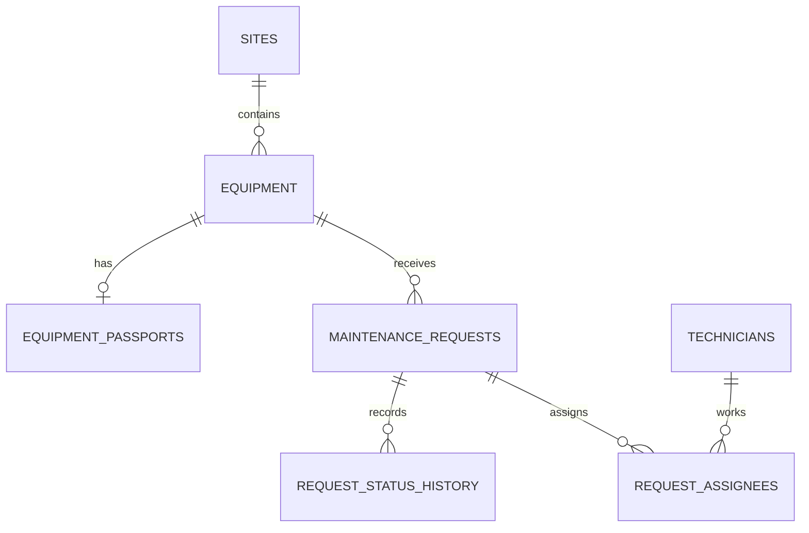

# Weather Digest / Maintenance API

REST API для учёта оборудования и заявок на обслуживание производственной площадки.
Хранилище выбирается через `USE_POSTGRES`: `false` использует JSON-файлы, `true` — PostgreSQL.
Внешний прогноз использует Open-Meteo.

## Быстрый запуск API

Этот режим предназначен для локальной разработки: API запускается на `http://localhost:3000` и по умолчанию использует JSON-файлы. Для защиты и полного стека используйте Docker Compose по инструкции ниже.

```bash
npm install
npm run dev
```

Для локального запуска порт задаётся переменной `PORT`. PostgreSQL используется только при `USE_POSTGRES=true` и настроенном подключении к БД.

## PostgreSQL и Docker

Проект подготовлен под PostgreSQL 16, который запускается через Docker Compose. Перед запуском установите и запустите Docker Desktop. В корне репозитория создайте `.env` и задайте уникальные значения обязательных секретов:

```powershell
Copy-Item .env.example .env
# Отредактируйте .env: задайте DB_PASSWORD, JWT_SECRET,
# BOOTSTRAP_ADMIN_EMAIL, BOOTSTRAP_ADMIN_PASSWORD,
# GRAFANA_ADMIN_PASSWORD и ALERT_WEBHOOK_TOKEN.
docker compose up --build -d
docker compose ps
```

Compose поднимает PostgreSQL 16, одноразовый контейнер `db-setup` для миграций и seed, API, Nginx, Prometheus, Alertmanager и Grafana. API ждёт готовности БД и успешного завершения `db-setup`. Первое создание образов может занять несколько минут.

Наружу опубликован только Nginx на порту 80. Пользуйтесь адресами:

- `http://localhost/` — проверка Nginx;
- `http://localhost/api/docs/` — Swagger UI;
- `http://localhost/api/openapi.json` — OpenAPI JSON;
- `http://localhost/api/health/ready` — готовность API и подключения к БД;
- `http://localhost/grafana/` — Grafana.

Порты API `3000`, PostgreSQL `5432`, Prometheus `9090` и Grafana `3000` доступны только внутри Docker-сети, напрямую с хоста они не опубликованы. Nginx ограничивает доступ к Grafana и `/metrics` loopback- и частными IP-адресами.

При первом запуске в пустом auth-хранилище создаётся admin с учётными данными из `BOOTSTRAP_ADMIN_EMAIL` и `BOOTSTRAP_ADMIN_PASSWORD`. Auth-хранилище лежит в Docker volume `api-data`; изменение bootstrap-переменных не меняет уже созданную учётную запись. Регистрация через API всегда создаёт пользователя `viewer`. Учётные данные Grafana задаются `GRAFANA_ADMIN_USER` и `GRAFANA_ADMIN_PASSWORD`.

Seed загружает демонстрационные данные один раз и отмечается в БД. Стандартный набор: 2 площадки, 6 единиц оборудования, 20 заявок и 5 специалистов. Если в `DATA_DIR` доступны `equipment.json` и `requests.json` из Кейса 2, seed импортирует их вместо создания соответствующих демонстрационных записей. Существующие Docker volumes сохраняются между перезапусками, поэтому seed не выполняется заново при каждом `up`.

Проверка стека и логи:

```bash
docker compose ps
docker compose logs --tail 100 db-setup
docker compose logs -f api
docker compose logs -f alertmanager
```

Для остановки без удаления данных выполните `docker compose down`. Не используйте `docker compose down -v` для обычной остановки: команда удаляет volumes, включая данные PostgreSQL и Grafana.

Параметры подключения PostgreSQL задаются переменными окружения. Не коммитьте `.env`; для эксплуатации используйте уникальные случайные значения секретов.

Параметры подключения берутся из переменных окружения:

- `DB_HOST`
- `DB_PORT`
- `DB_NAME`
- `DB_USER`
- `DB_PASSWORD`
- `DB_POOL_MIN`
- `DB_POOL_MAX`
- `DB_POOL_IDLE_TIMEOUT`

В Compose миграции и seed применяются автоматически контейнером `db-setup`. Следующие команды запускаются на хосте и предназначены для отдельно запущенного API/БД. Для обслуживания базы из Compose запустите CLI в контейнере:

```powershell
docker compose run --rm db-setup npm run db:migrate
docker compose run --rm db-setup npm run db:seed
```

Для локального окружения с доступной БД:

```bash
npm run db:migrate
npm run db:seed
```

Локальный API использует PostgreSQL только при `USE_POSTGRES=true` и корректно заданных параметрах подключения.

Откат миграций:

```powershell
docker compose run --rm db-setup npm run db:migrate:undo
```

Полный откат схемы (удаляет все таблицы, созданные миграциями):

```powershell
docker compose run --rm db-setup npm run db:migrate:undo:all
```

Для локальной БД вне Compose используйте соответствующие `npm run db:migrate:undo` и `npm run db:migrate:undo:all`. Перед откатом сделайте резервную копию.

Схема хранится в каталоге `src/db/migrations`, модели — в `src/db/models`, а seed-данные — в `src/db/seeders`.

API доступен за Nginx на `http://localhost`; интерактивная документация — `http://localhost/api/docs/`, OpenAPI JSON — `http://localhost/api/openapi.json`. Старый CLI запускается через `npm run cli -- --city "Москва" --days 3`.

## Схема PostgreSQL



`request_assignees` реализует связь N:M и запрещает повторную пару `(request_id, technician_id)` уникальным индексом. Удаление площадки с оборудованием и оборудования с заявками запрещено (`RESTRICT`); паспорт удаляется вместе с оборудованием, назначения — вместе с заявкой. История статусов сохраняется и блокирует физическое удаление заявки (`RESTRICT`).

## Отчёты

- `GET /api/sites/:id/summary` возвращает количество заявок площадки по статусам и приоритетам и среднее время закрытия завершённых заявок.
- `GET /api/reports/equipment-load?period=month&minRequests=2&siteId=<uuid>` группирует заявки по оборудованию. Период: `all`, `week`, `month` или `quarter`; `minRequests` применяется в SQL через `HAVING`.
- Оба аналитических endpoint выполняют агрегаты в PostgreSQL при `USE_POSTGRES=true`.

## Переменные окружения API

Полный перечень и безопасные шаблоны находятся в `.env.example`. Для Compose обязательны `DB_PASSWORD`, `JWT_SECRET` (не менее 32 символов), `BOOTSTRAP_ADMIN_EMAIL`, `BOOTSTRAP_ADMIN_PASSWORD`, `GRAFANA_ADMIN_PASSWORD` и `ALERT_WEBHOOK_TOKEN`. `LOG_LEVEL` принимает `error`, `warn`, `info` или `debug`; `TRUST_PROXY=true` используется за Nginx. Access JWT по умолчанию живёт 900 секунд. Refresh token передаётся только в `HttpOnly` cookie с `SameSite=Lax`; в production установлен `Secure`, локальный HTTP использует `Secure=false`, иначе браузер не отправит cookie.

## Роли

| Роль | Доступ |
| --- | --- |
| `viewer` | Чтение справочников, оборудования, заявок, истории и отчётов |
| `technician` | Права viewer, создание/редактирование заявок и смена статуса только назначенной заявки |
| `admin` | Управление оборудованием, назначение бригад и удаление записей |

Публичная регистрация всегда назначает `viewer`; роль из тела запроса игнорируется. Bootstrap admin создаётся только при пустом auth-хранилище. Вход ограничен пятью попытками за 15 минут; ответы для неизвестной учётной записи и неверного пароля одинаковы.

## API

| Метод | Путь | Назначение |
| --- | --- | --- |
| POST | `/api/auth/register` | Регистрация viewer |
| POST | `/api/auth/login` | Вход, выдача access token и refresh cookie |
| POST | `/api/auth/refresh` | Обновление access token |
| POST | `/api/auth/logout` | Отзыв refresh-сессии |
| GET | `/api/auth/me` | Текущая учётная запись и роль |
| GET | `/api/health` | Проверка доступности |
| GET | `/api/health/live` | Жизнеспособность процесса |
| GET | `/api/health/ready` | Готовность API и БД |
| GET | `/api/docs/` | Swagger UI |
| GET | `/api/openapi.json` | OpenAPI 3.0 |
| GET/POST | `/api/equipment` | Список / создание оборудования |
| GET/PATCH/DELETE | `/api/equipment/:id` | Карточка, изменение, удаление |
| GET | `/api/equipment/:id/requests` | Заявки оборудования |
| GET | `/api/equipment/:id/weather` | Прогноз и пригодность наружных работ |
| GET/POST | `/api/requests` | Список / создание заявки |
| GET/PATCH/DELETE | `/api/requests/:id` | Карточка, изменение, удаление |
| PATCH | `/api/requests/:id/status` | Контролируемая смена статуса |
| POST/DELETE | `/api/requests/:id/assignees` и `/api/requests/:id/assignees/:userId` | Назначение и снятие специалистов |
| GET | `/api/requests/:id/history` | История смены статусов |
| GET | `/api/sites/:id/summary` | Сводка площадки |
| GET | `/api/reports/equipment-load` | Нагрузка на оборудование |

`GET /api/health` и `/api/health/ready` проверяют PostgreSQL-соединение при `USE_POSTGRES=true` и возвращают 503 при недоступной БД. `/api/health/live` проверяет, что процесс API отвечает.

Изменяющие маршруты требуют bearer access token и соответствующую роль. Запрос без токена получает 401, недостаточная роль — 403. Метрики `/metrics` ограничены Nginx по IP; Prometheus опрашивает API по внутренней Docker-сети.

Списки поддерживают `page`, `limit`, `sortBy`, `order`; сортируемые поля ограничены allowlist. В PostgreSQL фильтрация, сортировка и пагинация выполняются в SQL. Оборудование фильтруется по `type` и
`status`, заявки по `equipmentId`, `status` и `priority`. Ответ списка имеет вид `{ data, meta: { total, page, limit } }`.

Заявка проходит переходы `new -> in_progress -> done`, а также `new -> rejected` и
`in_progress -> rejected`. Завершённые и отклонённые заявки не меняют статус; нарушение возвращает 409.
Погодное окно пригодно, если осадки равны нулю и максимальный ветер ниже `OUTDOOR_WIND_MAX`.

Ошибки имеют единый формат:

```json
{"error":{"code":"VALIDATION_ERROR","message":"Некорректные данные запроса","details":[{"field":"priority","message":"Недопустимый приоритет"}],"requestId":"..."}}
```

## Пример

```powershell
curl.exe -X POST http://localhost/api/equipment `
  -H "Content-Type: application/json" `
  -H "Authorization: Bearer <access-token>" `
  -d '{"name":"Турбина A-1","type":"turbine","serialNumber":"WT-001","location":{"lat":55.75,"lon":37.61},"status":"operational","installedAt":"2020-01-01T00:00:00.000Z"}'
```

Для Compose сначала выполните вход через `POST /api/auth/login` в Swagger и передайте полученный `accessToken` как bearer token. В Swagger это можно сделать кнопкой **Authorize**.

`helmet` устанавливает защитные заголовки, CORS разрешает только `CORS_ORIGINS`, а rate limit
возвращает 429 и стандартные заголовки лимита. Каждый запрос получает `x-request-id`, который
попадает в структурированный лог и ответ ошибки.

## Мониторинг и эксплуатация

Grafana dashboard `Maintenance API overview` provisioned автоматически. Технические графики используют `http_requests_total`, `http_request_duration_seconds` и Prometheus `up`; прикладные gauges считываются из PostgreSQL при scrape. Alertmanager отправляет `ApiTargetDown` и `ApiHigh5xxRate` во внутренний alert receiver API, который пишет событие в stdout. При срабатывании проверьте `docker compose logs api alertmanager`, найдите `requestId`, затем проверьте PostgreSQL и `GET /api/health/ready`.

Если БД недоступна: проверьте `docker compose ps`, `docker compose logs postgres`, credentials и readiness; после восстановления Compose перезапустит API. При росте 5xx изучите структурированные логи API и соответствующий `requestId`. При нехватке диска проверьте Docker volumes и свободное место до очистки: `pgdata`, `api-data`, `prometheus-data` и `grafana-data` содержат данные. Не используйте `docker compose down -v` для обычной остановки.

Миграции применяются при старте через `db-setup`. Откат одной миграции: `docker compose run --rm db-setup npm run db:migrate:undo`; полный откат схемы: `docker compose run --rm db-setup npm run db:migrate:undo:all`. Перед откатом сделайте резервную копию БД.

Тесты запускаются командой `npm test`; `npm run test:coverage` формирует текстовый и lcov отчёт. Полный локальный gate: `npm run check`.

## Архитектура и ограничения

Маршруты находятся в `src/routes`, бизнес-правила — в `src/services`, PostgreSQL и JSON реализации — в `src/repositories`; история статусов и назначения хранятся отдельно. Статусная операция использует транзакционный repository-метод в PostgreSQL. Погодный прогноз зависит от Open-Meteo. Auth-store в production хранится в отдельном файловом Docker volume, поэтому текущий вариант рассчитан на один экземпляр API; для горизонтального масштабирования его следует перенести в общую PostgreSQL-схему. HTTPS и CI pipeline не входят в текущий обязательный стек.

## Структура

`src/routes` маршруты, `src/services` бизнес-правила, `src/repositories` JSON-хранилище,
`src/middleware` request ID, логирование, валидация и ошибки, `src/app.js` сборка приложения,
`src/server.js` запуск. Тесты запускаются `npm test`, проверка `npm run check`.

---

## Утилита погоды из Кейса 1 (отдельный CLI)

Это сохранённая утилита первого кейса, а не веб-интерфейс сервиса заявок. Она запускается отдельно из корня проекта и получает погодный дайджест через REST API Open-Meteo. Приложение:

- получает координаты города по геокодингу;
- запрашивает прогноз на несколько дней;
- печатает результат в читаемом виде в терминал;
- сохраняет отчёт в JSON-файл;
- использует кэш по городу и дате;
- корректно обрабатывает ошибки и завершает процесс с кодом 0 или 1.

## Требования

- Node.js 20+
- npm
- доступ в интернет

### Установка CLI

1. Склонируйте проект или откройте папку с репозиторием.
2. Перейдите в корень проекта:

```bash
cd weather-digest
```

3. Установите зависимости:

```bash
npm install
```

4. При необходимости создайте файл `.env` на основе `.env.example`:

```bash
Copy-Item .env.example .env
```

### Переменные окружения CLI

Проект читает следующие параметры:

- `GEOCODING_BASE_URL` — базовый URL сервиса геокодирования, по умолчанию `https://geocoding-api.open-meteo.com/v1/search`
- `FORECAST_BASE_URL` — базовый URL прогноза погоды, по умолчанию `https://api.open-meteo.com/v1/forecast`
- `REQUEST_TIMEOUT` — таймаут запроса в миллисекундах, по умолчанию `5000`
- `REPORTS_DIR` — каталог для хранения JSON-отчётов, по умолчанию `reports`

Пример файла `.env`:

```env
GEOCODING_BASE_URL=https://geocoding-api.open-meteo.com/v1/search
FORECAST_BASE_URL=https://api.open-meteo.com/v1/forecast
REQUEST_TIMEOUT=5000
REPORTS_DIR=reports
```

### Запуск CLI

Основной запуск:

```bash
node src/index.js --city "Москва" --days 3
```

Несколько городов:

```bash
node src/index.js --city "Казань, Санкт-Петербург" --days 5
```

Запуск без сети / с принудительным обновлением:

```bash
node src/index.js --city "Москва" --days 3 --no-cache
```

Справка:

```bash
node src/index.js --help
```

> В Windows PowerShell наиболее надёжно запускать утилиту напрямую через `node src/index.js ...`. Передача аргументов через `npm start` / `npm run` может интерпретироваться не так, как ожидается.

### Параметры CLI

- `--city` — обязательный параметр. Допускает одно название города или список городов через запятую.
- `--days` — необязательный параметр. Целое число от 1 до 7, по умолчанию `3`.
- `--no-cache` — необязательный параметр. Принудительно выполняет сетевой запрос без чтения локального кэша.
- `--help` / `-h` — выводит справку по использованию.

### Пример вывода

```text
City: Москва
Country: Россия
Coordinates: 55.75204, 37.61781

Date                Min °C   Max °C   Precipitation
------------------  -------  -------  -------------
2026-09-13     7.7    16.2             0
2026-09-14     9.2    18.4             0
2026-09-15    11.7    18.6           0.1
```

### Пример вывода для нескольких городов

```text
City: Казань
Country: Россия
Coordinates: 55.78874, 49.12214

Date                Min °C   Max °C   Precipitation
------------------  -------  -------  -------------
2026-09-13    10.7      17             0
2026-09-14    10.2    18.1             0
2026-09-15    10.8    17.4             3

City: Санкт-Петербург
Country: Россия
Coordinates: 59.93863, 30.31413

Date                Min °C   Max °C   Precipitation
------------------  -------  -------  -------------
2026-09-13    12.7    16.6           8.8
2026-09-14      13      17           0.6
2026-09-15      11    16.8             0
```

### Кэширование и отчёты

После каждого успешного запуска приложение сохраняет отчёт в каталог `reports/` по шаблону:

```text
reports/{city}-{YYYY-MM-DD}.json
```

Пример:

```text
reports/москва-2026-09-13.json
reports/казань-2026-09-13.json
```

Если отчёт за текущую дату уже существует, приложение читает его из кэша, если флаг `--no-cache` не передан.

### Обработка ошибок

Утилита корректно обрабатывает следующие сценарии:

- отсутствует или некорректен параметр `--city`;
- пустой результат геокодинга (город не найден);
- ответ API со статусом 4xx;
- ответ API со статусом 5xx;
- отсутствие сети или недоступность сервиса;
- превышение таймаута запроса;
- некорректный JSON в ответе;
- неизвестные аргументы командной строки.

При ошибке приложение пишет понятное сообщение и завершает процесс с кодом `1`.
При успехе — завершает процесс с кодом `0`.

### Структура проекта CLI

```text
src/
  api/            Клиент внешнего REST API
  cli/            Разбор аргументов командной строки
  format/         Форматирование вывода в терминал
  services/       Бизнес-логика и создание отчётов
  storage/        Работа с файлами, кэш и отчёты
  config.js       Конфигурация приложения через переменные окружения
  index.js        Точка входа приложения

tests/            Базовые тесты для логики и CLI
reports/          Директория с сохранёнными JSON-отчётами
docs/
  postman/        Экспортированная коллекция Postman
```

### Полезные команды CLI

```bash
node src/index.js --city "Москва" --days 3
node src/index.js --city "Казань, Санкт-Петербург" --days 5 --no-cache
npm test
npm run lint
npm run check
```

### Примечание

Проект реализован без стороннего HTTP-клиента, с использованием встроенного `fetch`, `async/await` и `AbortController` для ограничения времени запроса. Основная цель — консольный погодный дайджест с сохранением результатов в локальные JSON-отчёты.

## Production readiness / Case 4

Стек поддерживает базовую эксплуатационную готовность: аутентификацию, чтение токенов в заголовке `Authorization: Bearer ...`, refresh-cookie сессии, ограничение частоты попыток входа и маршрутизированный мониторинг.

### Роли и права

| Роль | Права |
| --- | --- |
| `viewer` | чтение справочников, заявок, истории и отчётов |
| `technician` | `viewer` + создание, редактирование заявок и смена статуса только по назначенным заявкам |
| `admin` | полный доступ к оборудованию, площадкам, назначению бригад и удалению |

Для включения обязательной аутентификации задайте:

```env
AUTH_REQUIRED=true
JWT_SECRET=replace-me-with-long-random-secret
JWT_ACCESS_TTL=900
JWT_REFRESH_TTL=604800
```

### Эндпоинты аутентификации

```http
POST /api/auth/register
POST /api/auth/login
POST /api/auth/refresh
POST /api/auth/logout
GET /api/auth/me
```

Пароли хранятся в виде PBKDF2-хеша с солью, а в ответах API и логах не передаются. Токен доступа подписывается секретом из `.env`.

### Развёртывание стека

```powershell
Copy-Item .env.example .env
# Задайте все обязательные секреты, перечисленные в разделе «PostgreSQL и Docker».
docker compose up --build -d
docker compose ps
```

В составе стека:

- `nginx` как reverse proxy на `:80`;
- `api` сервис Node.js на порту `3000`;
- `postgres` как база данных с томом `pgdata`;
- `prometheus` для сбора метрик;
- `grafana` на `http://localhost/grafana/` с автоматической настройкой datasource и dashboard.

### Метрики и мониторинг

Приложение отдаёт метрики на маршруте `/metrics` в формате Prometheus. Grafana подключается автоматически через provisioning в `deploy/grafana/...`.

### Полезные ссылки

- `http://localhost` — Nginx entry point;
- `http://localhost/grafana/` — Grafana;
- `http://localhost/api/health` — проверка доступности;
- `http://localhost/api/health/ready` — readiness-check с учётом БД.

### Операционные рекомендации

- следите за логами через docker compose logs -f api;
- проверяйте состояние сервисов через `docker compose ps`;
- для отката миграций Compose используйте `docker compose run --rm db-setup npm run db:migrate:undo` или `docker compose run --rm db-setup npm run db:migrate:undo:all`; перед откатом сделайте резервную копию БД.

Для деплоя за Nginx и Grafana используйте файлы в `deploy/` и настройку `AUTH_REQUIRED=true` при необходимости строгой работы по ролям.
